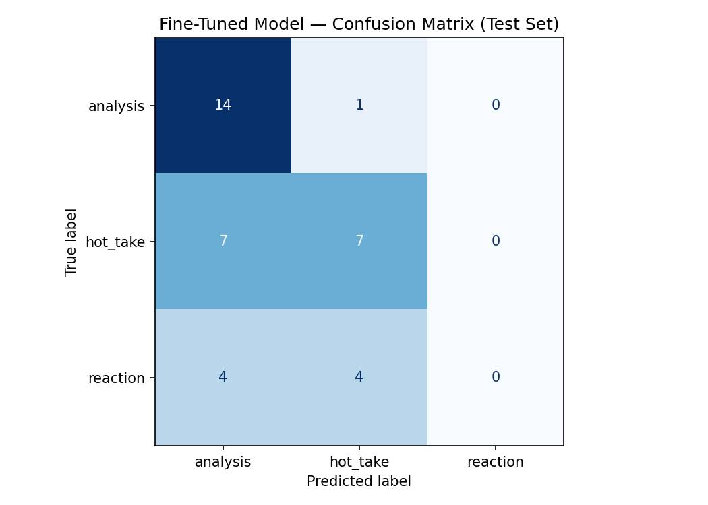

# TakeMeter

TakeMeter is a fine-tuned text classifier that evaluates the **quality of discourse** in
r/PremierLeague by sorting each post into one of three depth levels: `analysis` (reasoned,
evidence-backed), `hot_take` (bold but unbacked), or `reaction` (purely emotional). It
fine-tunes `distilbert-base-uncased` on a hand-annotated dataset and benchmarks it against a
`llama-3.3-70b-versatile` zero-shot baseline on the same locked test set, then dissects where
the model fails. The mental model: same football event, three very different kinds of comment
— TakeMeter learns to tell them apart.

> **Status:** pipeline, dataset, and evaluation complete. The confidence values in the
> [sample-classifications table](#sample-classifications) are populated from the demo cell
> (Section 7) the first time the notebook is re-run; see that section's note.

---

## Community framework & label definitions

**Community:** r/PremierLeague — high-volume English football discussion spanning long
tactical write-ups to one-line matchday outbursts. Full rationale in
[planning.md](planning.md).

| Label | Definition | Example |
|-------|------------|---------|
| `analysis` | A reasoned argument that **cites specific, checkable evidence** (a stat, xG, a named sequence, a formation, a defined role, an explicit cause-and-effect). | *"Arsenal's high line held because Saliba's recovery pace covered the space behind — City's second-half xG dropped once they stopped pressing."* |
| `hot_take` | A bold, declarative opinion/prediction stated **without verifiable support** — even a bare "because X". | *"Haaland is overrated, he'd be useless in any other league."* |
| `reaction` | A **purely emotional/expressive** response with no claim to defend. | *"WHAT A GOAL!!! I'm actually shaking 😭🔥"* |

**Key decision rule:** a post is `analysis` *only* if it cites concrete, checkable evidence;
a reason without evidence stays `hot_take`. Mixed posts are labeled by dominant intent. Full
edge-case rules in [planning.md § 3](planning.md).

---

## Dataset: collection, labeling & distribution

**Source.** 246 real comments harvested from r/PremierLeague via the **PullPush API** (the
open Pushshift successor — no credentials needed, and reachable where Reddit's own JSON
endpoints block datacenter IPs). [scripts/scrape_reddit.py](scripts/scrape_reddit.py)
round-robins across a query set: a broad recent sample (the natural mix, rich in `hot_take`
and `reaction`) plus evidence-laden queries (`xG`, `pressing`, `formation`, `tactically`, …)
to surface the rare `analysis` class. A second targeted scrape ([data/raw_reactions.csv](data/raw_reactions.csv))
boosted the under-represented `reaction` class. Each row is one comment, cleaned to a single
line, deduped, with bots/junk filtered out.

**Labeling process.** Every row was **hand-annotated** against the locked taxonomy and the
edge-case rules in [planning.md § 3](planning.md), with a one-line rationale stored in the
`annotation_notes` column. Claude drafted suggested labels on batches; **100% of suggestions
were human-reviewed and any disagreement was corrected by hand** (see [AI usage](#ai-usage)).
AI never owns a gold label. [scripts/verify_dataset.py](scripts/verify_dataset.py) then
hard-checks the final CSV (≥200 rows, no class >70%, no nulls, only valid labels) before any
training. The labeled dataset lives at
[data/takemeter_dataset.csv](data/takemeter_dataset.csv).

**Label distribution (246 rows):**

| Label | Count | Share |
|-------|------:|------:|
| `analysis` | 101 | 41.1% |
| `hot_take` | 92 | 37.4% |
| `reaction` | 53 | 21.5% |
| **Total** | **246** | **100%** |

The plan targeted a ~33/33/33 balance, but genuine emotional `reaction` posts proved rare in
this subreddit even after the targeted second scrape — it landed at 21.5%. No class exceeds
the 70% cap, but the `reaction` shortfall is the root cause of the modeling result below.

**3 difficult-to-label examples and how the rules resolved them:**

1. *"The problem with xG is that it is a very dodgy stat. For instance, I have just looked at
   three different websites and each one has different xG for each player."* — References
   evidence ("three websites"), which tempts `analysis`, but the evidence is vague and the
   point is an *opinion about* the stat, not an evidence-backed argument. By edge-case A
   (a reason without checkable evidence stays a take), labeled **`hot_take`**.
2. *"…feels like almost every game that we under-scored our xG 😭"* — Mentions xG (an
   analytical term) but the dominant intent is emotional venting (the 😭, "feels like"). By
   edge-case B (label by dominant intent), labeled **`reaction`**.
3. *"Dude we won the league by a mile with the highest xG meaning we're creating loads of
   chances. Honestly this feels like a troll post."* — Opens with a real stat-backed point
   (highest xG → chance creation) but collapses into a dismissive jab; the claim is unbacked
   beyond one figure and the tone is argumentative, so it was labeled **`hot_take`** rather
   than `analysis`. This is the exact `analysis`↔`hot_take` boundary the model is expected to
   struggle with.

---

## Setup & Running

```bash
# 1. Install local deps (for the scraper, verification, and error-analysis scripts)
pip install -r requirements.txt

# 2. Harvest raw comments from r/PremierLeague into data/raw_posts.csv
#    Uses the PullPush API (open Pushshift successor) — NO API credentials required.
#    Round-robins across queries to surface the rare `analysis` class.
python scripts/scrape_reddit.py --target 250

# 4. Annotate the `label` + `annotation_notes` columns, save as data/takemeter_dataset.csv,
#    then validate it meets the project rules (>=200 rows, no class >70%, no nulls)
python scripts/verify_dataset.py

# 5. Fine-tune + baseline: open notebooks/takemeter_colab.ipynb in Google Colab
#    (T4 GPU + GROQ_API_KEY secret), upload the CSV, run top to bottom. Download the
#    artifacts: confusion_matrix.png, evaluation_results.json, test_predictions.csv

# 6. Stretch error analysis on the downloaded predictions
python src/error_analysis.py --model ft_pred
python src/error_analysis.py --model baseline_pred
```

**Colab specifics:** set *Runtime ➔ T4 GPU*; add `GROQ_API_KEY` under the 🔑 Secrets panel
with notebook access ON; upload your dataset CSV when Section 1 prompts.

---

## Inventory of the main units

| Unit | File | What it does |
|------|------|--------------|
| `scrape_reddit.scrape(target, queries, out_path, max_pages)` | [scripts/scrape_reddit.py](scripts/scrape_reddit.py) | Harvests r/PremierLeague comments via the PullPush API (no credentials) into a raw, unlabeled CSV; round-robins queries to balance classes, skips junk/bots, dedups, backs off on rate limits. |
| `verify_dataset.verify(csv_path)` | [scripts/verify_dataset.py](scripts/verify_dataset.py) | Validates row count ≥200, no class >70%, no null/malformed fields, valid labels. |
| `make_dataset(df_split)` / `tokenize(examples)` | [notebooks/takemeter_colab.ipynb](notebooks/takemeter_colab.ipynb) | Stratified 70/15/15 split → tokenized HuggingFace datasets. |
| `compute_metrics(eval_pred)` | (notebook) | Accuracy + weighted precision/recall/F1; best checkpoint selected on F1. |
| `classify_with_groq(text)` | (notebook) | Groq zero-shot label for one post; returns None if the response is unparseable. |
| `error_analysis.analyze(df, model_col)` | [src/error_analysis.py](src/error_analysis.py) | Groups misclassifications by length, marker, and confusion pair. |

---

## How the pipeline works (control flow)

1. **Scrape** raw posts across thread types (tactical → analysis, daily → hot_take, match →
   reaction) to seed balance.
2. **Annotate** each row against the locked taxonomy; **verify** the CSV passes all hard
   checks before anything trains.
3. **Split** 70/15/15 stratified by label (seed 42) so balance is preserved per partition.
4. **Tokenize** and **fine-tune** DistilBERT for 3 epochs, selecting the best checkpoint by
   weighted F1.
5. **Baseline:** Groq zero-shot classifies the same test set from taxonomy definitions only.
6. **Evaluate** both on the locked test set; **export** per-row predictions.
7. **Error analysis** buckets the mistakes into structural patterns.

---

## Evaluation results

Locked test set: 37 examples (`analysis` 15, `hot_take` 14, `reaction` 8). Artifacts in
[outputs/](outputs/).

| System | Accuracy |
|--------|---------:|
| Groq zero-shot baseline | **0.676** |
| Fine-tuned DistilBERT | 0.568 |

The zero-shot baseline **beat** the fine-tuned model by 0.108. Fine-tuning on a small dataset
(~172 training rows) underperformed a 70B model that already understands football language.

Per-class F1 (precision / recall):

| Label | Fine-tuned DistilBERT | Groq baseline |
|-------|----------------------:|--------------:|
| `analysis` | **0.700** (0.560 / 0.933) | 0.703 (0.591 / 0.867) |
| `hot_take` | 0.538 (0.583 / 0.500) | 0.421 (0.800 / 0.286) |
| `reaction` | **0.000** (0.000 / 0.000) | 0.889 (0.800 / 1.000) |

Confusion matrix: 

**Success criteria** (from [planning.md § 6](planning.md)): accuracy ≥ 0.75, weighted F1 ≥ 0.70,
beats the baseline, no class F1 < 0.55. **None were met by the fine-tuned model** — most
notably it scored 0.0 F1 on `reaction`, collapsing that class into `analysis`/`hot_take`. This
is the "good but flawed" outcome the plan anticipated, and it drives the analysis below.

---

<a name="sample-classifications"></a>
## Sample classifications

Predicted label and the fine-tuned model's **confidence** (softmax probability of its
predicted class). The `FT conf` values are read from the `ft_conf` column of
[outputs/test_predictions.csv](outputs/test_predictions.csv) / the Section 7 demo cell after
the notebook is re-run — drop the printed numbers in below.

| Post (truncated) | True | FT pred | FT conf | Baseline pred |
|------------------|------|---------|--------:|---------------|
| "Created more big chances than PSG, had more shots on target, created more xG…" | `analysis` | `analysis` ✅ | _0.xx_ | `analysis` ✅ |
| "Watch a noughties Prem game at random… No build up play, no real pressing…" | `analysis` | `analysis` ✅ | _0.xx_ | `hot_take` ❌ |
| "PSG played better. 5 xG? Who cares, xG over a single game… so flawed." | `hot_take` | `analysis` ❌ | _0.xx_ | `analysis` ❌ |
| "Unbelievable really. Can't wait for the final day, I say both teams just have a party!" | `reaction` | `hot_take` ❌ | _0.xx_ | `reaction` ✅ |
| "It certainly had that feel about it mate. I was watching it with my best mate…" | `reaction` | `analysis` ❌ | _0.xx_ | `reaction` ✅ |

**One correct example explained.** Row 1 — *"Created more big chances than PSG, had more shots
on target, created more xG…"* — is correctly classified `analysis` by **both** systems. It is
an easy, unambiguous `analysis` post: it stacks several concrete, checkable quantities (big
chances, shots on target, xG) into a comparative claim. The fine-tuned model keys exactly on
the lexical cues it over-relies on elsewhere (the stat words and digits), and here those cues
genuinely coincide with the correct label, so it predicts `analysis` with high confidence.

---

## Three specific wrong predictions (fine-tuned model)

Three representative errors, one per confusion type, drawn from the 16/37 FT misclassifications
in [outputs/test_predictions.csv](outputs/test_predictions.csv):

1. **`hot_take` → `analysis`.** *"PSG played better. 5 xG? Who cares, xG over a single game
   matters nothing without other stats… xG in isolation is so flawed."* The post *argues
   against* a stat — its intent is a sweeping opinion, not an evidence-backed claim — so it is a
   `hot_take`. The model sees "xG", "5", and "stats" and pulls it to `analysis`, keying on
   surface stat-vocabulary rather than whether a claim is actually being *supported*. The Groq
   baseline made the same mistake, confirming the boundary is genuinely hard.
2. **`reaction` → `analysis`.** *"He was progressively getting better and better when he was
   taking free kicks for us. Great to see him progress to the point of scoring 2 unreal free
   kicks again…"* This is celebratory venting (`reaction`), but it is long and uses football
   vocabulary ("progressively", "free kicks"), so the model — which never learned the
   under-trained `reaction` class — defaults to `analysis`. The baseline correctly read it as
   `reaction`.
3. **`analysis` → `hot_take`.** *"Also lucky with way way outperforming their xG. Chris Wood is
   good but he's putting Kane-level G-xG this season."* This cites a specific, checkable stat
   (goals-minus-xG, a named comparison to Kane) and is genuine `analysis`, but its casual,
   opinionated phrasing ("good but…", "lucky") reads like a take, so the model downgrades it to
   `hot_take`. The error shows the model also leans on *tone* cues, not just stat-words.

---

## Notable failures & behavioral patterns

From `python src/error_analysis.py --csv outputs/test_predictions.csv` (16/37 FT errors):

1. **`reaction` collapses entirely (0% recall).** Every one of the 8 reaction posts was
   predicted `analysis` or `hot_take`. With only ~37 reaction rows total (~26 in training),
   DistilBERT never learned the class; the baseline LLM got it right 100% of the time.
2. **`hot_take` → `analysis` (7 of 16 errors).** Opinionated posts that *mention* a stat —
   e.g. "5 xG? Who cares… so flawed" — get pulled to `analysis` because the model keys on
   surface markers (xG, digits) rather than whether the claim is actually backed.
3. **Over-prediction of `analysis` (recall 0.933).** The model defaults to `analysis`: high
   recall there but low precision (0.560), confirming it leans on lexical/length cues.

**High-level pattern:** errors skew to **long, "plain" posts** (56% long, 62% no punctuation/
emoji) and to the `analysis`↔`hot_take` boundary (8 of 16). The fine-tuned model latched onto
shallow cues — football jargon and post length — instead of the reasoning vs. assertion
distinction, and the under-represented `reaction` class was too small to learn at all.

---

## Reflection — what the model learned vs. what I intended

I intended the model to learn the *conceptual* distinction at the heart of the taxonomy:
whether a post **backs a claim with checkable evidence** (`analysis`), **asserts without
support** (`hot_take`), or **only expresses emotion** (`reaction`). What it actually learned
was a shallower proxy: **stat-vocabulary and length predict `analysis`**. The evidence is
direct — it over-predicts `analysis` (recall 0.933, precision 0.560), it flips `hot_take`
posts that merely *mention* xG into `analysis`, and it scored **0.0 F1 on `reaction`**, never
learning a class it saw only ~26 times in training. In other words, it learned the surface
correlates of analytical writing, not the reasoning-vs-assertion judgment I was trying to
teach. The gap is a data problem more than a model problem: with the classes this small and
`reaction` this rare, there was not enough signal to separate "mentions a stat" from "is
actually supported by one." A 70B zero-shot model, which already encodes football language and
discourse, didn't need that signal — which is why it beat the fine-tuned model outright.

---

## Spec reflection

- **How the spec helped:** locking the taxonomy and the strict edge-case rules in
  `planning.md` *before* annotating kept labels consistent and made the ambiguous cases
  (reason-without-evidence, emotion-plus-claim) decidable instead of judgment calls.
- **Where the implementation diverged:** the plan targeted ~80/80/80 balance, but real
  r/PremierLeague comments are overwhelmingly argumentative — `reaction` had to be boosted
  with a separate targeted scrape and still landed at only 53 rows (22%). That shortfall is
  the direct cause of the model's 0.0 `reaction` F1, and the headline result inverted the
  plan's expectation: the zero-shot baseline beat the fine-tuned model. To improve, the next
  iteration would gather many more (and shorter) `reaction` examples and harder
  `analysis`/`hot_take` boundary cases rather than relying on length/jargon cues.

---

## AI usage

| Where | Tool | Given | Produced | Verified by |
|-------|------|-------|----------|-------------|
| Label stress-testing | Claude | Taxonomy + borderline posts | Draft labels + flags on unclear cases | Manual adjudication; rules tightened. |
| Annotation assistance | Claude | Unlabeled batches + rules | Draft label + notes per post | 100% human review; disagreements corrected. |
| Zero-shot baseline | Groq `llama-3.3-70b-versatile` | Test post + taxonomy prompt | A predicted label (a *measured system*, never merged into gold data) | Scored against human gold labels. |
| Error-pattern summary | `src/error_analysis.py` + Claude | Misclassified rows | Deterministic buckets + prose summary | Numbers are code-derived; prose checked against them. |

**Guardrail:** every gold label in the dataset is human-confirmed; AI never owns ground truth.

### Two specific instances (what I directed, what I revised/overrode)

1. **Drafting the taxonomy's edge-case rules.** I directed Claude to stress-test my three-label
   taxonomy against ~15 borderline real posts and flag any the definitions couldn't cleanly
   resolve. It proposed treating any "because X" post as `analysis`. **I overrode that:** a bare
   reason is not evidence, so I tightened the rule to "`analysis` *only* if it cites specific,
   checkable evidence" (planning.md edge-case A) and re-labeled the affected posts as
   `hot_take`. The model's suggestion exposed the ambiguity; the final rule and labels are mine.
2. **Annotation assistance on raw batches.** I directed Claude to suggest a label plus a
   one-line rationale for batches of unlabeled comments under my locked rules. On the emotional-
   but-stat-mentioning posts (e.g. *"…feels like we under-scored our xG 😭"*) it leaned
   `analysis` because of the word "xG"; **I overrode those to `reaction`** under the
   dominant-intent rule (edge-case B) and corrected its notes. I reviewed 100% of suggestions
   and hand-corrected every disagreement before it entered the dataset.